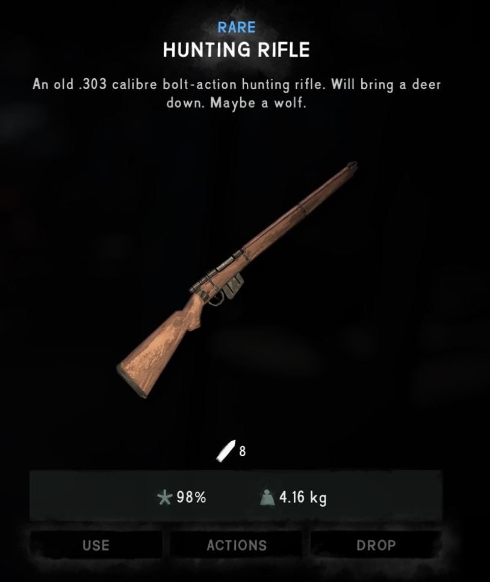

# Item Rarities

 

Item Rarities is a modification that enhances the existing UI by adding visual elements to display the rarity of certain items in [The Long Dark](https://www.hinterlandgames.com/the-long-dark/), without impacting the core gameplay.

For further support, questions, or feedback, please join my [discord server](https://discord.gg/ZmMNzUzV6A).

For insights about upcoming updates, visit the [**Roadmap**](ROADMAP.md).

For insights about existing updates, visit the [**Changelog**](CHANGELOG.md).

>**Disclaimer:** This modification is not an official part of The Long Dark and is not affiliated with Hinterland Studio Inc.

## Features
- **Rarity Classification:** Each item now has a distinct visual indicator which represents its rarity.
- **Enhanced Immersion**: Rarer items now feel like they worth something once found.
- **No Dependencies Required**: This modification works alone without anything else.

## Installation
1. [Download](https://github.com/LavaGang/MelonLoader/releases/latest) the latest version of MelonLoader.
2. [Download](https://github.com/Deaadman/ItemRarities/releases/latest) the latest version of this modification.
3. Navigate to the game's mod directory: `[Path to The Long Dark Installation]\mods`.
4. Copy the `ItemRarities.dll` from your `Downloads` folder and paste it into the `mods` directory.
5. Launch the game. The mod should be active.

## Compatibility
**Tested and Compatible with (as of 06-September-2023):**  

- **The Long Dark:** [Version 2.22](https://store.steampowered.com/news/app/305620?updates=true) 
- **MelonLoader:** [Version 0.6.1](https://github.com/LavaGang/MelonLoader/blob/master/CHANGELOG.md)

>**Disclaimer:** This modification may not be compatible with older versions of The Long Dark, MelonLoader or other modifications, using it with incompatible versions or incompatible modifications may result in crashes, errors and unexpected behaviours.

## Known Issues
Any issues for this modification will be made known here. Report issues either through my [discord server](https://discord.gg/ZmMNzUzV6A) or the [issues](https://github.com/Deaadman/ItemRarities/issues) tab within this github repository.

## License
This modification is released under the **MIT License.**

Under the MIT License you have to right to:

-   Use this mod for any purpose, whether it's personal or commercial.
-   Modify the mod to suit your needs, and those modifications can be kept private or shared with others.
-   Distribute this mod in its original or modified form, either for free or as part of a paid product, without imposing any additional restrictions.
-   The only requirement is that the original copyright and license information must be included when you distribute the mod.
